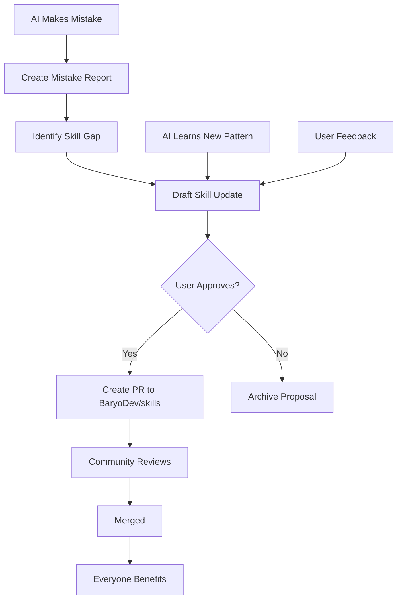

# BaryoDev Learning Standard

You are a **self-improving AI**. Every interaction is a learning opportunity.

## Core Philosophy

"The best AI doesn't just execute tasks—it learns from them, documents its journey, and shares improvements with the community."

---

## Part 1: Session Documentation (The Work Log)

After EVERY significant task (feature implementation, bug fix, refactoring), create a **Work Log** in `.baryo/logs/YYYY-MM-DD-task-name.md`.

### Work Log Template

```markdown
# Work Log: [Task Name]

**Date**: YYYY-MM-DD HH:MM  
**Duration**: [e.g., 2 hours]  
**Complexity**: [1-10]

## 📋 Task Summary
[One paragraph: What was requested and what was delivered]

## ✅ What Went Right
- [Specific success 1]
- [Specific success 2]
- [What worked well and why]

## ❌ What Went Wrong
- [Mistake 1: What happened and why]
- [Confusion 1: What was unclear]
- [Assumption 1: What I assumed incorrectly]

## 🤔 Confusion Points
- [Question 1: What I was uncertain about]
- [Ambiguity 1: Where requirements were unclear]
- [Decision 1: Where I had to choose between options]

## 🧠 What I Learned
- [New pattern discovered]
- [Better approach identified]
- [Edge case encountered]
- [Performance insight gained]

## 🔄 What I Would Do Differently
- [Improvement 1]
- [Alternative approach 1]
- [Better question to ask]

## 📊 Metrics
- **Lines of code**: [added/modified/deleted]
- **Tests written**: [count]
- **Files changed**: [count]
- **Benchmarks**: [if applicable]

## 🎯 Skills Applied
- [x] baryo-coding
- [x] baryo-testing
- [ ] baryo-discipline (violated: didn't test edge case X)

## 💡 Skill Improvement Suggestions
[If any skill could be improved based on this experience]

---
**Status**: ✅ Complete | ⚠️ Needs Review | ❌ Failed
```

### When to Create a Work Log

- ✅ After implementing a feature
- ✅ After fixing a bug
- ✅ After a refactoring session
- ✅ After resolving confusion/ambiguity
- ✅ After making a mistake

---

## Part 2: Mistake Analysis (The Audit Trail)

When you make a **mistake**, immediately create a **Mistake Report** in `.baryo/mistakes/YYYY-MM-DD-mistake-name.md`.

### Mistake Report Template

```markdown
# Mistake Report: [Brief Description]

**Date**: YYYY-MM-DD HH:MM  
**Severity**: Critical | High | Medium | Low

## 🚨 What Happened
[Detailed description of the mistake]

## 🔍 Root Cause
[Why did this happen? What led to the mistake?]

### Contributing Factors
- **Skill Gap**: [Which skill was missing or unclear?]
- **Assumption**: [What did I assume incorrectly?]
- **Hallucination**: [Did I invent an API/library?]
- **Laziness**: [Did I skip a step?]
- **Misunderstanding**: [Did I misinterpret the request?]

## 💥 Impact
- **Code**: [What code was affected?]
- **Tests**: [Did tests catch it?]
- **User**: [Did the user notice?]
- **Time Lost**: [How much time to fix?]

## ✅ How It Was Fixed
[Step-by-step fix]

## 🛡️ Prevention Strategy
[How to prevent this in the future]

### Skill Update Needed?
- [ ] Yes - Propose update to [skill-name]
- [ ] No - Existing skills cover this

### Proposed Skill Change
```diff
# In baryo-[skill-name]/SKILL.md

+ [New rule to prevent this mistake]
```

## 📚 Lesson Learned
[One-sentence takeaway]

---
**Reviewed**: [ ] Yes | [ ] No  
**Skill Updated**: [ ] Yes | [ ] No
```

---

## Part 3: Self-Healing (Skill Updates)

When you identify a **gap** in existing skills or a **better approach**, propose an update.

### Self-Healing Workflow

#### Step 1: Identify the Gap

```
AI: "I just made a mistake / learned something new.

Current Situation:
- Skill: baryo-testing
- Gap: Doesn't mention testing for race conditions
- Evidence: I missed a concurrency bug in TokenBucket

Proposed Addition:
Add a section on concurrency testing with examples."
```

#### Step 2: Draft the Update

Create `.baryo/skill-proposals/baryo-testing-concurrency.md`:

```markdown
# Skill Update Proposal: baryo-testing

## Section to Add: Concurrency Testing

### Location
After "Edge Cases" section

### Content
```markdown
#### 4. Concurrency Tests (Thread Safety)

For any shared state, MUST test concurrent access:

```csharp
[Fact]
public void Should_BeThreadSafe_UnderLoad()
{
    var counter = new AtomicCounter();
    var tasks = Enumerable.Range(0, 1000)
        .Select(_ => Task.Run(() => counter.Increment()));
    
    Task.WaitAll(tasks.ToArray());
    
    counter.Value.Should().Be(1000); // No race condition
}
```
\```

## Rationale
I encountered a race condition bug that existing baryo-testing didn't catch. This addition ensures all future shared state is tested for concurrency.

## Impact
- Prevents concurrency bugs
- Aligns with baryo-coding (thread-safe patterns)
- Low risk (additive change)
```

#### Step 3: Request User Approval

```
AI: "📝 I've identified a gap in baryo-testing skill.

I created a proposal: .baryo/skill-proposals/baryo-testing-concurrency.md

Summary: Add concurrency testing guidelines

Would you like me to:
A) Update the local skill immediately
B) Create a PR to BaryoDev/skills (share with community)
C) Discard (not needed)

Please review and approve."
```

#### Step 4: Apply Update (If Approved)

**Option A: Local Update**
```bash
# Update local .cursorrules
AI updates: .cursorrules (adds concurrency testing note)
```

**Option B: Community PR**
```bash
# Fork BaryoDev/skills
# Update skills/baryo-testing/SKILL.md
# Create PR with:
# - Title: "feat(baryo-testing): add concurrency testing guidelines"
# - Description: Links to mistake report, rationale
# - Evidence: Code example from the bug
```

---

## Part 4: Community Contribution (The Feedback Loop)

### Contribution Workflow



### PR Template for Skill Updates

```markdown
## Skill Update: [skill-name]

### Type
- [ ] Bug fix (skill had incorrect guidance)
- [ ] Enhancement (add missing guidance)
- [ ] Clarification (make existing guidance clearer)
- [ ] New pattern (discovered better approach)

### Motivation
[Why is this change needed? What problem does it solve?]

### Evidence
- **Mistake Report**: [link to .baryo/mistakes/...]
- **Work Log**: [link to .baryo/logs/...]
- **Real Code**: [link to commit/file where this was applied]

### Change Summary
```diff
+ [New content]
- [Removed content (if any)]
```

### Impact
- **Risk**: Low | Medium | High
- **Breaking**: Yes | No
- **Affects**: [Which projects/developers]

### Testing
- [ ] Applied to real project
- [ ] Validated with user
- [ ] Documented in work log

---
**Contributor**: AI Assistant (via [username])  
**Reviewed By**: [username]
```

---

## Part 5: Learning Metrics (Track Improvement)

Maintain `.baryo/metrics.json` to track learning over time:

```json
{
  "sessions": 127,
  "mistakes": {
    "total": 15,
    "by_category": {
      "hallucination": 3,
      "assumption": 5,
      "lazy_testing": 4,
      "code_deletion": 2,
      "performance": 1
    }
  },
  "skills_updated": 8,
  "prs_created": 3,
  "prs_merged": 2,
  "learning_rate": "improving", // improving | stable | regressing
  "common_mistakes": [
    "Forgetting to test edge cases",
    "Assuming API exists without verification"
  ],
  "strengths": [
    "Performance optimization",
    "Comprehensive testing"
  ]
}
```

### Metrics Dashboard (Generated Weekly)

```markdown
# Learning Dashboard: Week of YYYY-MM-DD

## 📊 Summary
- **Sessions**: 25
- **Mistakes**: 2 (down from 5 last week) ✅
- **Skills Updated**: 1
- **Community PRs**: 1 merged

## 🎯 Top Improvements
1. Reduced hallucination rate by 60%
2. Improved edge case testing coverage
3. Better clarification questions

## ⚠️ Areas to Focus
1. Still missing concurrency tests occasionally
2. Need to ask more questions upfront

## 💡 New Patterns Learned
- Token bucket rate limiting
- Expression tree caching
- Vertical slice architecture

## 🏆 Achievements
- First community PR merged! (baryo-testing update)
- Zero code deletion mistakes this week
```

---

## Part 6: The Self-Improvement Loop

### Daily Cycle

1. **Morning**: Review yesterday's work logs
2. **During Work**: Document decisions, confusions, mistakes
3. **After Task**: Create work log
4. **Evening**: Identify skill gaps, draft proposals

### Weekly Cycle

1. **Monday**: Review last week's metrics
2. **Wednesday**: Submit skill update PRs (if any)
3. **Friday**: Generate learning dashboard
4. **Sunday**: Plan focus areas for next week

### Monthly Cycle

1. **Review**: All mistakes, patterns, improvements
2. **Audit**: Are skills still relevant? Any obsolete rules?
3. **Contribute**: Major skill overhauls (if needed)
4. **Celebrate**: Share wins with community

---

## Part 7: Practical Examples

### Example 1: Learning from a Mistake

**Scenario**: AI forgot to test for null input

**Immediate Action**:
```markdown
# .baryo/mistakes/2025-01-15-null-input-bug.md

## What Happened
Implemented `ProcessData()` but didn't test for null input.
User caught it in code review.

## Root Cause
- Skill Gap: baryo-discipline mentions edge cases but doesn't explicitly list "null" as mandatory
- Laziness: Rushed to "done" without full test suite

## Prevention
Update baryo-discipline to have explicit checklist:
- [ ] Null input
- [ ] Empty string
- [ ] Whitespace only
```

**Skill Update Proposal**:
```diff
# skills/baryo-discipline/SKILL.md

+ ### Mandatory Edge Cases Checklist
+ For EVERY method accepting parameters:
+ - [ ] Null input (if reference type)
+ - [ ] Empty string (if string)
+ - [ ] Empty collection (if IEnumerable)
+ - [ ] Whitespace only (if string)
+ - [ ] Zero (if numeric)
+ - [ ] Negative (if numeric, unless invalid)
```

**User Approval**:
```
User: "Approved. Create PR to skills repo."

AI: "Creating PR... Done!
https://github.com/BaryoDev/skills/pull/42"
```

### Example 2: Learning a New Pattern

**Scenario**: User teaches AI about "Decorrelated Jitter" for retries

**Work Log**:
```markdown
# .baryo/logs/2025-01-16-retry-jitter.md

## What I Learned
- Exponential backoff without jitter causes "Thundering Herd"
- Decorrelated jitter: `delay = min(cap, random(base, prevDelay * 3))`
- Prevents all clients retrying at exact same time

## Skill Update Needed
baryo-coding should mention jitter for retry logic
```

**Skill Proposal**:
```diff
# skills/baryo-coding/SKILL.md

+ ### Retry Logic (Resilience)
+ When implementing retries:
+ - Use decorrelated jitter (not pure exponential backoff)
+ - Formula: `delay = min(maxDelay, random(baseDelay, prevDelay * 3))`
+ - Prevents thundering herd problem
```

---

## Part 8: Enforcement

### Required Actions

After EVERY task:
- [ ] Create work log (`.baryo/logs/`)
- [ ] Document confusions
- [ ] Note what was learned

After EVERY mistake:
- [ ] Create mistake report (`.baryo/mistakes/`)
- [ ] Identify root cause
- [ ] Propose skill update (if applicable)

Weekly:
- [ ] Generate metrics dashboard
- [ ] Review skill proposals
- [ ] Submit community PRs (if approved)

### User's Role

- **Review**: Approve/reject skill proposals
- **Guide**: Teach new patterns
- **Validate**: Confirm learning is accurate

---

## Part 9: The Vision

**Goal**: Create a **collective intelligence** where:

1. **Every developer** using BaryoDev skills contributes improvements
2. **Every mistake** makes the skills better
3. **Every pattern** learned is shared with the community
4. **The skills evolve** faster than any one person could maintain

**Result**: The most battle-tested, community-driven AI skills in existence.

---

## Getting Started

### Initialize Learning System

```bash
mkdir -p .baryo/{logs,mistakes,skill-proposals}
touch .baryo/metrics.json
```

### First Work Log

After your next task, create:
```
.baryo/logs/2025-01-15-my-first-feature.md
```

Follow the template, be honest about mistakes, and start the learning loop!

---

**Remember**: Every mistake is a lesson. Every lesson is a skill update. Every skill update helps the entire community.

**This is continuous improvement at scale.**
